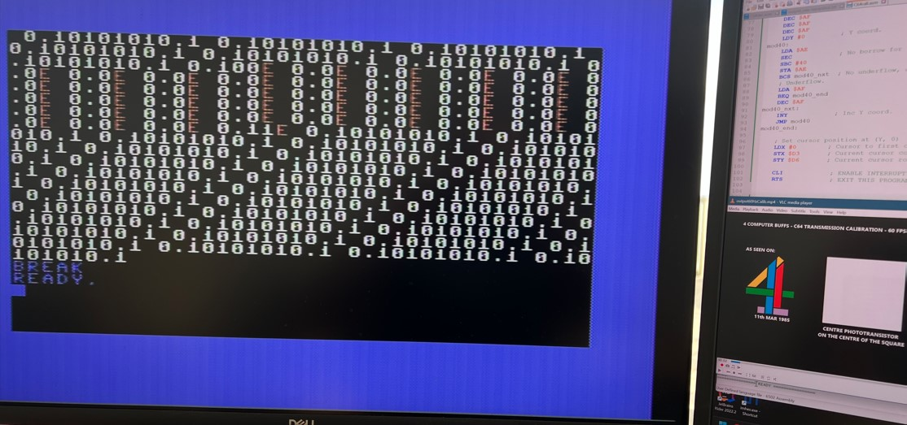

Here are the calibration and decoder programs for the Commodore 64.  
They are intended to be used with the original DIY hardware described in the TV show.  
They should work with both CRT and LCD monitors, and with both 50 Hz (original) and 60 Hz (sped-up/simulated) videos.  

**IMPORTANT**: Be sure your video player is using **V-Sync** for playback.  
**IMPORTANT**: Be sure **de-interlacing** is **DISABLED**.  
**IMPORTANT**: Your CRT or LCD **refresh rate MUST match** the field or frame rate of the video.  

A start menu allows selecting either 50 Hz or 60 Hz screen and provide the respective preset timing delay for the C64 model in use. PAL or NTSC model is autodetected.
In any case, the timing delay can be adjusted pressing + and - and the current delay will be shown in yellow in the upper left corner of the screen (it's displayed in hex).  

Both programs are launched using:

  SYS 49152

Use RUN/STOP to exit. You can then re-launch the program and the previous timing will be remembered.  
If you want to revert to default timing, just reload the program.  

**CALIBRATION**

To calibrate the hardware, you can still use the original calibration program that Channel 4 provided in 1985, though that was intended to work only with a PAL C64 receiving a PAL video.  

However, it is recommended to use the calibration program you find here, which is to be used in conjunction with one of the calibration videos below (50 or 60 Hz):
- 50 Hz calibration video: [TODO: Provide video].
- 60 Hz calibration video: [TODO: Provide video].
Adjust the potentiometer until 0 and 1 are alternating, and no red "E" (which stands for Error) is displayed on screen (for at least 5 seconds).

A successful calibration:

**DECODING**

The decoder program injects the received BASIC program directly in memory.  
When the end of the stream is reached, the decoder program will automatically exit.  
You can then type "LIST" to visualize the BASIC program received.  

Border color shows the decoder status:
- Yellow: Waiting for start code.
- Red: Timing delay.
- Black: Processing current bit.

The decoder generates an on screen debug output using the following syntax for each encoded byte:
- 1 bit: Start code (must be 0)
- "."
- 8 bits: Byte read (least significant bit first)
- "."
- 2 bits: First two bits of the stop sequence. The first one should be a 0. The second one should be a 1.
- " " (whitespace)

At any time, if an error is detected, a red "E" character is output on screen.  

